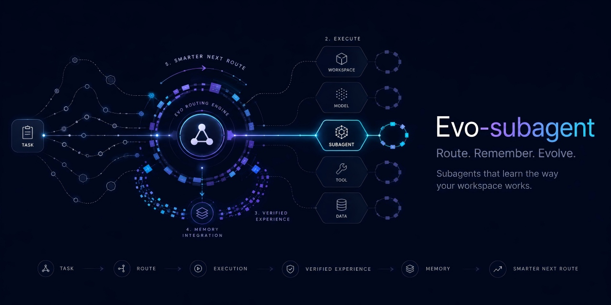

# evo-subagent



[English](README.md) | [简体中文](README.zh-CN.md)

[](https://www.npmjs.com/package/evo-subagent)
[](LICENSE)
[](package.json)

`evo-subagent` is a lightweight plugin for [DeepSeek Harness](https://github.com/deepseek-ai/deepseek-harness). It pulls together three capabilities that today live scattered across separate plugins — **role-based subagent routing**, **per-agent evolution** (verified commands + lessons), and **a knowledge allow/deny list** — so repeated tasks start from what already works instead of rediscovering it: fewer retries, fewer re-debugged bugs, fewer tokens.

### Routing

Each stable `agent_key` maps to a same-named Markdown binding file declaring an exact `provider`/`model` pair already registered in DSH. Different subagent roles (code reviewer, test runner, researcher, planner, verifier, data analyst, ...) can therefore use predictable model routes without duplicating credentials or maintaining a second provider config. The pair is validated against the live DSH model registry before any child spawns.

### Evolution (knowledge allow/deny)

The plugin continuously maintains `prefercmd` (verified commands) and `memory` (lessons learned) per agent and per workspace. Think of `prefercmd` as a **whitelist** — the subagent starts from commands proven to work instead of re-deriving them — and `memory` as a **blacklist** — mistakes are recorded so they are not made, or debugged, again. Together they stop repeated runs from wasting tokens on rediscovery and re-debugging.

### Zero-config, project-scoped

Bindings and evolution are isolated per project workspace (`.evo_subagent/` under the nearest folder owning an `agents/` directory), with official built-in role templates that work out of the box. Nothing depends on where DSH was launched, and the plugin stores no API keys, endpoints, credentials, or provider definitions.

## Features

- Maps each `agent_key` to a same-named Markdown binding file.
- Reads strict `provider` and `model` metadata from a fenced front matter block.
- Validates the exact provider/model pair against the live DSH model registry before spawning.
- Auto-maintains per-agent / per-workspace `prefercmd` + `memory` evolution files (whitelist + blacklist of knowledge), injected into each foreground run.
- Supports foreground one-shot runs and continuable background subagents.
- Preserves DSH's native parent-model inheritance when no binding file exists.
- Stores no API keys, endpoints, credentials, or provider definitions.
- Delegates child creation to the official DSH `spawn` provider.

## Installation

Install the published npm package into a DSH profile:

```sh
dsh plugin add evo-subagent
```

Install directly from GitHub:

```sh
dsh plugin add github:ZekaiShi/evo-subagent
```

For local development:

```sh
dsh plugin add ./evo-subagent
```

Add `--profile <name>` to target a non-default profile.

## Binding files

The filename stem is the `agent_key`. Every binding starts with a strict four-line front matter block. The opening and closing fences must be exactly `---`, with no blank lines inside:

```md
---
provider: deepseek-official
model: deepseek-v4-flash
---

# Code reviewer
Optional notes for people or external tooling may follow this header.
```

For a file named `code-reviewer.md`, call the registered tool with `agent_key: "code-reviewer"`:

```json
{
  "agent_key": "code-reviewer",
  "description": "Review implementation",
  "prompt": "Inspect the supplied change and report correctness, security, and test coverage issues.",
  "run_in_background": true
}
```

Only the fenced front matter is routing metadata. The remaining Markdown content is not automatically appended to the child prompt; the tool call's `prompt` is the authoritative task sent to the subagent.

## Built-in roles

The plugin ships **official role templates** in `templates/` that work with zero
configuration — no binding file needed. When an `agent_key` has no matching file
in your binding directory, the plugin falls back to the bundled template of the
same name, using its `provider`/`model` route and its role instructions.

| agent_key | Role | Notes |
| --- | --- | --- |
| `code-reviewer` | Rigorous code review with severity-ranked findings | structured Markdown report |
| `researcher` | Evidence-backed investigation with cited sources | facts vs. inferences, confidence |
| `wps-worker` | Office-document producer via the Python trio | python-pptx / python-docx / openpyxl; **confirms before writing files** |

Official roles are written with a `name(evo-subagent)` suffix — e.g.
`code-reviewer(evo-subagent)` — to mark them as built-in and distinguish them
from your own custom bindings. You can use the suffix anywhere the official
source matters (docs, prompts, conversation); the plugin matches on the bare
`agent_key` stem.

To use a built-in role, pass an empty `prompt` (the role's own instructions are
injected), or pass your own `prompt` to override them:

```json
{
  "agent_key": "code-reviewer",
  "description": "Review the change",
  "prompt": "",
  "run_in_background": false
}
```

A template's `provider`/`model` must be registered in your DSH profile (the same
validation as user bindings); an unregistered pair fails before any child starts.
Overriding a built-in role works by creating your own `<agent_key>.md` in the binding
directory — your file wins over the template.

## Evolution mode

The plugin continuously refines per-agent `prefercmd` (verified commands) and
`memory` (lessons learned) files to reduce token waste on repeated runs by
shortening the rediscovery loop — `prefercmd` acts as a **whitelist** of
commands known to work, `memory` as a **blacklist** of mistakes already made,
so a subagent never re-derives a command or re-debugs a known failure.

- **Storage keeps entries whole; the size guarantee lives at injection.**
  Each stored file is deduplicated and bounded by entry count (40 prefercmd,
  25 memory), never by truncating an entry — a long command or lesson is kept
  in full even when a file grows beyond 4000 chars. The one hard bound is the
  injected context: each run injects the two files as a block capped at
  `MAX_INJECT_CHARS` (6000). What gets injected is decided by priority, then
  compressed by summarization — information is condensed, not discarded.

- **Entry priority.** Prefix an entry to control how it is injected:
  `!` marks it **P0 permanent** (always injected in full, never compressed or
  dropped), `?` marks it **P2 compressible** (injected last; the first to be
  summarized or skipped when the budget is tight, though it stays in the file),
  and an unprefixed entry is **P1 normal** (injected newest-first into the
  remaining budget). Budget allocation is P0 → P1 → P2.

- **Similar-command summarization.** Instead of injecting every concrete
  command, `prefercmd` entries that share the same leading token and appear
  `>= 3` times collapse into a single summary line (e.g. `git …（3 条相关命令：
  …）`), and any single entry longer than 300 chars is condensed to a short
  head + ellipsis. A custom summarizer can be supplied via
  `buildInjectionAsync` (`options.summarize`, e.g. an LLM-backed summarizer
  over `ctx.llm`) for semantic summaries.

- **Default: on.** Disable with `evolution: false` in the plugin config or the
  `EVO_SUBAGENT_EVOLUTION=false` environment variable.
- **Per-conversation workspace, not the launch directory.** Each time the
  `evo_subagent` tool runs, the plugin reads the conversation's working
  directory (`exec.agent.session.header.cwd`, the same field the DSH shell tool
  resolves its workdir from) and walks up to the nearest folder that owns an
  `agents/` directory — the project workspace. That folder becomes the bindings
  directory and evolution lives under
  `<project>/.evo_subagent/evolution/<agent_key>/prefercmd.md` and
  `memory.md`. Different projects therefore never share subagent bindings or
  evolution state, and nothing depends on where the DSH process was launched.
  When a conversation has no session cwd or its workspace has no `agents/`
  folder, the plugin falls back to `bindingsDir` / `EVO_SUBAGENT_EVOLUTION_DIR`
  / the process working directory. The evolution files never appear in the
  project's `agents/` folder. The `<project>/.evo_subagent/` directory is created
  lazily: it only lands on disk when a subagent actually runs and reports
  evolution content (or when you save manually from the settings card) -
  workspace scanning and project detection are strictly read-only. Existing
  former `.smart_subagent/evolution` data remains a read-only fallback and is
  copied into the new location on the first save; legacy files are never
  deleted automatically.
- On each foreground run the plugin injects the two files as a bounded context
  block (capped at `MAX_INJECT_CHARS` = 6000 chars) into the child prompt, so
  the subagent starts from proven commands instead of re-deriving them.
- At the end of a foreground run the plugin scans the final output for an
  `[[EVOLUTION]]` block and merges new entries:

  ```markdown
  [[EVOLUTION]]
  prefercmd:
  - pnpm test  # faster test runner
  memory:
  - don't use --force on CI
  [[/EVOLUTION]]
  ```

- Entries are deduplicated and kept within limits (40 prefercmd, 25 memory);
  the oldest entries are dropped first, so injection cost stays bounded.
- Background runs don't record (no final output is available to the caller).

Use `detectAgents(bindingsDir, templatesDir)` from `evo-subagent/evolution`
to list all available agent keys programmatically.

## Settings card

Under the web profile, Settings → Plugins shows an **evo-subagent** card that:

- **Groups subagents by project.** The scan source is the profile's
  registered **workspaces** (`ctx.workspaceRegistry` - the same workspaces the
  web UI groups sessions by): each workspace owns only the `agents/` folder
  right under it - no recursion into subdirectories. Zero configuration and
  portable across machines - move to another computer with different
  workspaces and the card follows automatically; if nothing is found it says
  so explicitly. Built-in templates are maintained as their own separate
  group and never mixed into a project. Only when a profile has no registered workspaces does it
  fall back to `EVO_SUBAGENT_PROJECTS_DIR` or a fallback dir set in the
  card.
- **Shows one fixed Main agent row per workspace.** Only the workspace-root
  `AGENTS.md` can be bound. Binding adds one reversible, marker-delimited
  instruction block and stores the selection in `.evo_subagent/config.json`.
  The main agent maintains its own `.evo_subagent/evolution/main/prefercmd.md`
  and `memory.md`; unbinding removes only the managed block. Workspaces without
  an `agents/` directory still appear so their Main agent can be configured.
- **Shows each agent's routing model** (provider · model from its front matter)
  and lets you **switch it with two dropdowns** for project bindings: a
  Provider dropdown listing every registered provider and a model dropdown
  listing that provider's registered models — any combination is selectable.
  The change rewrites the `provider:` and `model:` lines of the agent's `.md`
  file, the same file a developer would edit by hand; picking a provider
  auto-selects its first model. Built-in template agents are shown read-only.
- Edits each agent's hidden `prefercmd.md` / `memory.md` (per-project evolution
  files) and flips the global evolution toggle.

## Binding directory

Set the binding directory before starting DSH, in the same process environment you
launch DSH from. Relative paths resolve from the DSH launch working directory.

PowerShell:

```powershell
$env:EVO_SUBAGENT_BINDINGS_DIR = 'C:\path\to\agents'
dsh   # or however you normally start DSH (dsh web, desktop app, ...)
```

Bash:

```sh
EVO_SUBAGENT_BINDINGS_DIR=/absolute/path/to/agents dsh
```

`DSH_AGENT_BINDINGS_DIR` remains available as a compatibility fallback.

## Tool interface

The plugin registers `evo_subagent` by default.

| Field | Required | Description |
| --- | --- | --- |
| `agent_key` | Yes | Stable key used to resolve `<agent_key>.md`. |
| `description` | Yes | Short display label for the delegated task. |
| `prompt` | Yes | Complete task sent to the child agent. |
| `run_in_background` | No | Defaults to `true`; set to `false` for a foreground one-shot run. |

## Routing behavior

1. Validate the `agent_key` syntax and resolve its Markdown file safely.
2. Parse the fenced `provider` and `model` values in their fixed order.
3. Confirm that the provider exists in `ctx.llm.listProviders()`.
4. Confirm that the model exists in `ctx.llm.listModels(provider)`.
5. Start a fresh child through the configured DSH subagent provider.

An invalid binding fails before a child is created. A missing binding file is different: the plugin omits `agentOptions`, preserving the official DSH inheritance behavior.

## Spawn vs fork provider

The plugin is provider-agnostic: the same routing, validation, and result handling
apply regardless of which DSH in-process subagent provider is configured.

| Provider | Inherited context | Use for |
| --- | --- | --- |
| `spawn` (default) | none — fresh child, zero parent context | one-shot tasks fully described by `prompt` |
| `fork` | parent's completed turns (balanced prefix up to the last `turn/end`) | tasks that build on the current conversation |

To route via the fork provider, set `provider: fork` in the plugin config (see
[Bundle configuration](#bundle-configuration)). `agentOptions` — the validated
`provider`/`model` pair from a binding file — is passed to the child identically
for both providers; only the inherited conversation seed differs.

Fork inherits conversation history only: the child still gets a fresh scope and
does not inherit the parent's tool restrictions or authority.

## DeepSeek reasoning effort

`evo-subagent` does not override `reasoningEffort`. With `provider: deepseek-official`, the official DeepSeek adapter uses its configured default; the default DSH setting is `high`.

This keeps role files focused on provider/model routing and avoids introducing a second model-capability registry. Other registered providers retain their own adapter-defined reasoning behavior.

## Bundle configuration

The bundled patch installs the following defaults:

```yaml
- id: evo-subagent
  config:
    bindingsDir: /absolute/path/to/agents
    provider: spawn
    toolName: evo_subagent
    maxDepth: 3
```

To use fork-mode routing instead, override `provider` to `fork`:

```yaml
- id: evo-subagent
  config:
    bindingsDir: /absolute/path/to/agents
    provider: fork
    toolName: evo_subagent
    maxDepth: 3
```

DSH patch overrides replace the complete `config` object, so retain every field you still need when overriding this row.

## Security guarantees

- `agent_key` accepts only ASCII letters, digits, hyphens, and underscores.
- Path traversal through `agent_key` is rejected.
- Provider/model matching is exact and case-sensitive.
- Invalid bindings never fall back to another route.
- Binding files contain no credentials.
- Disabling this plugin removes only `evo_subagent`; the official `subagent` tool is unchanged.

## Development

Requires Node.js 22 or newer.

```sh
pnpm install
pnpm test
pnpm run check
npm pack --dry-run
```

The test suite covers strict front matter parsing, path safety, model registration checks, parent-route inheritance, foreground/background child creation, and the same routing guarantees under both the `spawn` and `fork` providers.

## License

[MIT](LICENSE)
