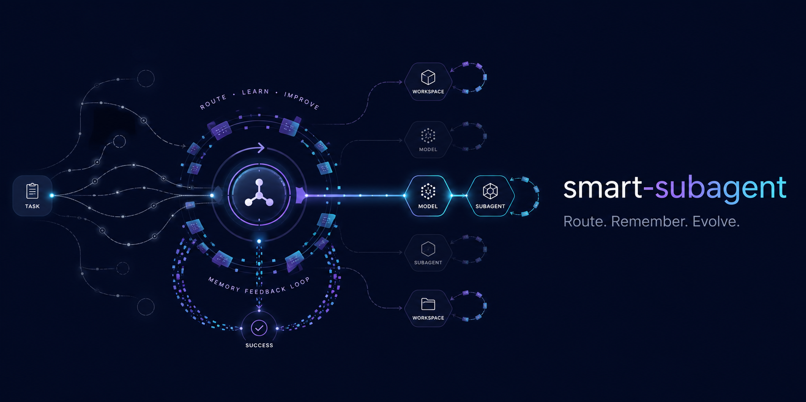

# smart-subagent



[English](README.md) | 简体中文

`smart-subagent` 是一个用于 [DeepSeek Harness](https://github.com/deepseek-ai/deepseek-harness) 的轻量插件。它把如今散落在不同插件里的三件事收拢到一起——**按角色的 subagent 路由**、**按 agent 的进化维护**（已验证命令 + 经验教训）、以及**一套知识的白名单/黑名单**——让重复任务从已经验证过的起点出发，而不是重新摸索：更少的重试、更少的重复 debug、更省的 token。

### 路由

每个稳定的 `agent_key` 映射到同名 Markdown 绑定文件，其中声明 DSH 中已注册的精确 `provider`/`model` 组合。不同的 subagent 角色（代码审查、测试执行、资料研究、方案规划、结果验证、数据分析……）因此可以使用可预期的模型路由，无需重复保存凭据或维护第二套 provider 配置。创建任何子代理前，该组合都会对照 DSH 实时模型注册表进行校验。

### 进化（知识的白名单/黑名单）

插件为每个 agent、每个工作区持续维护 `prefercmd`（已验证命令）和 `memory`（经验教训）。把 `prefercmd` 想成**白名单**——子代理从被证明可行的命令出发，而不是重新推导；把 `memory` 想成**黑名单**——犯过的错被记录下来，不再犯、也不再排一次 bug。二者合起来，让重复运行不再把 token 浪费在重新摸索和重新调试上。

### 零配置、按项目隔离

绑定与进化按项目工作区隔离（落在最近的、拥有 `agents/` 目录的文件夹下的 `.smart_subagent/`），并内置开箱即用的官方角色模板。一切与 DSH 从哪启动无关，插件也不保存任何 API Key、接口地址、凭据或 provider 定义。

## 功能特点

- 一个 `agent_key` 对应一个同名 Markdown 绑定文件。
- 严格读取由 `---` 包裹的 front matter 中的 `provider` 和 `model`。
- 创建子代理前，根据 DSH 实时模型注册表验证精确的 provider/model 组合。
- 自动维护按 agent / 按工作区的 `prefercmd` + `memory` 进化文件（知识的白名单 + 黑名单），并注入每次前台运行。
- 支持前台一次性执行和可持续的后台 subagent。
- 找不到绑定文件时，保留 DSH 官方的父模型继承行为。
- 不保存 API Key、接口地址、凭据或 provider 定义。
- 子代理创建交由 DSH 官方 `spawn` provider 完成。

## 安装

从 npm 安装到 DSH profile：

```sh
dsh plugin add smart-subagent
```

从 GitHub 安装：

```sh
dsh plugin add github:ZekaiShi/smart-subagent
```

本地开发安装：

```sh
dsh plugin add ./smart-subagent
```

如需指定非默认 profile，追加 `--profile <名称>`。

## 绑定文件

文件名（不含 `.md` 扩展名）就是 `agent_key`。每个绑定文件必须以严格的四行 front matter 开头。首尾分隔符必须为 `---`，内部不能插入空行：

```md
---
provider: deepseek-official
model: deepseek-v4-flash
---

# 代码审查代理
这里可以保存供人员或外部工具阅读的补充说明。
```

如果文件名为 `code-reviewer.md`，调用工具时传入 `agent_key: "code-reviewer"`：

```json
{
  "agent_key": "code-reviewer",
  "description": "审查实现",
  "prompt": "检查给定改动，并报告正确性、安全性和测试覆盖问题。",
  "run_in_background": true
}
```

只有 front matter 属于路由元数据。后续 Markdown 正文不会自动加入子代理提示词；工具调用中的 `prompt` 才是发送给 subagent 的权威任务内容。

## 进化模式（Evolution）

插件会为每个 agent 自动维护 `prefercmd`（已验证命令）和 `memory`（经验教训）两个文件，通过不断积累减少重复试错，降低 token 浪费——`prefercmd` 相当于**已验证命令的白名单**，`memory` 相当于**已犯错误的黑名单**，让子代理永远不必重新推导一条命令、也不必重复调试一个已知的坑。

- **存储保留完整条目，大小保证在注入侧。** 每个存储文件只做去重并按条目数上限控制（prefercmd 40 条 / memory 25 条），**绝不截断条目**——一条长命令或教训会完整保存，即使文件偶尔超过 4000 字符。唯一的硬上限是注入上下文：每次运行把两个文件作为受 `MAX_INJECT_CHARS`（6000）约束的块注入。注入什么由**优先级**决定，再由**摘要**压缩——信息是被浓缩，而不是被丢弃。

- **条目优先级。** 给条目加前缀来控制注入方式：`!` 表示 **P0 永久**（总是完整注入，永不压缩/永不丢弃）；`?` 表示 **P2 可压缩**（最后注入；预算紧张时最先被摘要或跳过，但仍保留在文件里）；无前缀为 **P1 普通**（在剩余预算内按最新优先注入）。预算分配顺序为 P0 → P1 → P2。

- **同类命令摘要。** 与其注入每条具体命令，`prefercmd` 中**相同命令前缀出现 ≥3 次**的条目会合并成一条摘要行（例如 `git …（3 条相关命令：…）`）；任何超过 300 字符的单条内容会被浓缩为短头部 + 省略号。如需语义更强的摘要，可给 `buildInjectionAsync` 传入 `options.summarize`（例如基于 `ctx.llm` 的 LLM 摘要器）。

- **默认开启**。可通过配置 `evolution: false` 或环境变量 `SMART_SUBAGENT_EVOLUTION=false` 关闭。
- **按对话工作区隔离，不依赖启动目录**。每次调用 `smart_subagent` 时，插件读取对话的工作目录（`exec.agent.session.header.cwd`，与 DSH 终端工具解析 workdir 的字段一致），向上找到最近的、拥有 `agents/` 目录的文件夹作为项目工作区；该目录即绑定目录，进化文件位于
  `<项目>/.smart_subagent/evolution/<agent_key>/prefercmd.md` 和
  `memory.md`——不同项目各自独立绑定与进化、互不污染，与 DSH 进程从哪启动无关。
  当对话没有会话 cwd、或其工作区没有 `agents/` 文件夹时，回退到 `bindingsDir` / `SMART_SUBAGENT_EVOLUTION_DIR` / 进程工作目录。
  文件**不会出现在你项目的 `agents/` 文件夹里**。`<项目>/.smart_subagent/` 目录也是**懒创建**的：只有某个 subagent 真正运行并回报了进化内容（或你在设置卡片里手动保存）时才会落盘，工作区扫描/项目检测是纯只读的。旧 `.dsh/smart-subagent/evolution` 数据继续作为只读回退；首次保存时复制到新目录，插件不会自动删除旧文件。
- 每次前台运行时，插件会把这两个文件作为有界上下文块注入子代理提示词（上限 `MAX_INJECT_CHARS` = 6000 字符），让 subagent 直接从已验证的命令出发，不用重新摸索。
- 前台运行结束后，插件会在最终输出中查找 `[[EVOLUTION]]` 块并合并新记录：

  ```markdown
  [[EVOLUTION]]
  prefercmd:
  - pnpm test  # 更快的测试运行器
  memory:
  - CI 环境不要用 --force
  [[/EVOLUTION]]
  ```

- 自动去重，条目有上限（prefercmd 40 条、memory 25 条），超限丢最旧——注入 token 成本恒定。
- 后台运行不记录（拿不到最终输出）。

可通过 `smart-subagent/evolution` 的 `detectAgents(bindingsDir, templatesDir)` 程序化列出所有可用 agent key。

## 设置卡片

web profile 下，设置 → 插件会出现一张 **smart-subagent** 卡片：

- **按项目分组展示 subagents**。扫描来源是该 profile 注册的所有**工作区**（`ctx.workspaceRegistry`，即你在 web 界面里看到的那些工作区）：每个工作区只认它**自己名下的 `agents/` 文件夹**（不递归子目录）。零配置、跨机器通用--换台电脑、换批工作区，卡片自动跟上；没有则明确显示"未发现"。内置模板单独成组、绝不混入项目组。
  仅当 profile 没有注册任何工作区时，才退回 `SMART_SUBAGENT_PROJECTS_DIR` / 卡片里填写的备用目录。
- **每个工作区固定显示一行 Main agent**。只允许绑定工作区根目录的 `AGENTS.md`；绑定时加入一个带起止标记、可安全撤销的维护提示块，并把选择保存到 `.smart_subagent/config.json`。主 Agent 单独维护 `.smart_subagent/evolution/main/prefercmd.md` 和 `memory.md`；解绑时只移除插件管理的提示块。即使工作区没有 `agents/` 目录，也会显示这一行。
- **双下拉切换路由**：Provider 下拉列出所有已注册 provider，模型下拉列出该 provider 的全部已注册模型，任何组合都能选；改动直接改写该 agent `.md` 文件的 `provider:` 与 `model:` 两行，切 provider 时自动选中其第一个模型。
  内置模板 agent 只读显示。
- 编辑每个 agent 的隐藏 `prefercmd.md` / `memory.md`（按项目的进化文件），并切换全局进化开关。

## 绑定目录

在启动 DSH 的同一进程环境中设置绑定文件目录。相对路径从 DSH 启动工作目录解析。

PowerShell：

```powershell
$env:SMART_SUBAGENT_BINDINGS_DIR = 'C:\path\to\agents'
dsh   # 或你平常启动 DSH 的方式（dsh web、桌面客户端等）
```

Bash：

```sh
SMART_SUBAGENT_BINDINGS_DIR=/absolute/path/to/agents dsh
```

插件仍将 `DSH_AGENT_BINDINGS_DIR` 作为兼容回退变量。

## 工具接口

插件默认注册 `smart_subagent`。

| 字段 | 必填 | 说明 |
| --- | --- | --- |
| `agent_key` | 是 | 用于解析 `<agent_key>.md` 的稳定键。 |
| `description` | 是 | 委派任务的简短显示名称。 |
| `prompt` | 是 | 发送给子代理的完整任务。 |
| `run_in_background` | 否 | 默认为 `true`；设为 `false` 时执行前台一次性任务。 |

## 路由流程

1. 验证 `agent_key` 格式并安全解析 Markdown 文件路径。
2. 按固定顺序解析 front matter 中的 `provider` 和 `model`。
3. 确认 provider 存在于 `ctx.llm.listProviders()`。
4. 确认 model 存在于 `ctx.llm.listModels(provider)`。
5. 通过配置的 DSH subagent provider 创建全新子代理。

无效绑定会在创建子代理前报错。缺少绑定文件则采用不同语义：插件不传递 `agentOptions`，保留 DSH 官方继承行为。

## DeepSeek 推理强度

`smart-subagent` 不覆盖 `reasoningEffort`。使用 `provider: deepseek-official` 时，由 DeepSeek 官方适配器采用其配置的默认值；DSH 默认设置为 `high`。

这样可以让绑定文件只负责 provider/model 路由，不引入第二套模型能力注册表。其他已注册 provider 继续使用各自适配器定义的推理行为。

## Bundle 配置

插件默认安装以下配置：

```yaml
- id: smart-subagent
  config:
    bindingsDir: /absolute/path/to/agents
    provider: spawn
    toolName: smart_subagent
    maxDepth: 3
```

DSH patch 覆盖会替换完整 `config`，自行覆盖时请保留仍需使用的字段。

## 安全保证

- `agent_key` 仅允许 ASCII 字母、数字、连字符和下划线。
- 拒绝通过 `agent_key` 进行目录穿越。
- provider/model 严格匹配并区分大小写。
- 无效绑定不会回退到其他模型路由。
- 绑定文件不包含任何凭据。
- 禁用插件只会移除 `smart_subagent`，不会修改官方 `subagent` 工具。

## 开发与验证

要求 Node.js 22 或更高版本。

```sh
pnpm install
pnpm test
pnpm run check
npm pack --dry-run
```

测试覆盖严格 front matter 解析、路径安全、注册模型验证、父模型继承以及前后台子代理创建。

## 许可证

[MIT](LICENSE)
